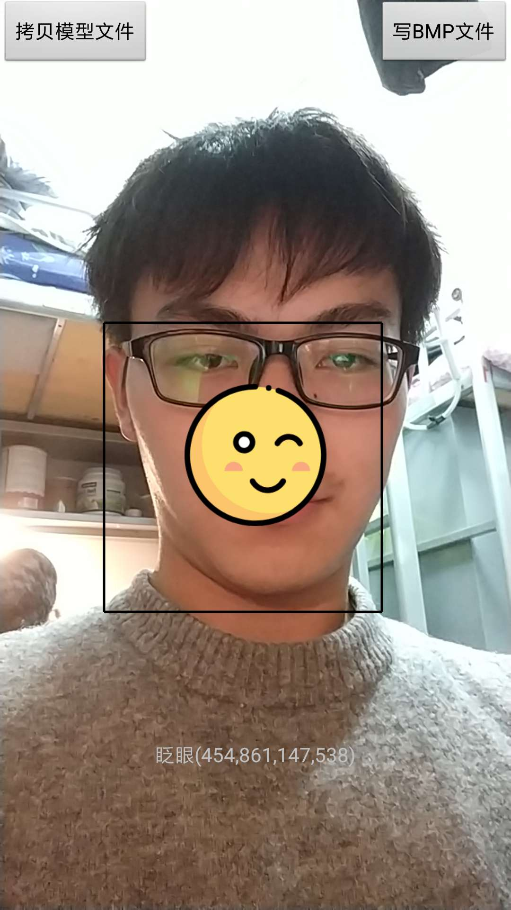

# NativeLearning
Chapter9 : classwork of  ByteDance Android training in BIT 


## 作业完成情况

1. 识别人脸动作，通过一个ImageView针对不同的表情显示不同的icon。

```java
            switch (ret) {
                            case FaceInfo.BEF_EYE_BLINK:
                                //眨眼
                                faceState = "眨眼";
                                ivEmotion.setImageResource(R.mipmap.eye_blink);
                                ivEmotion.setVisibility(View.VISIBLE);
                                break;
                            case FaceInfo.BEF_MOUTH_AH:
                                //嘴巴大张
                                faceState = "嘴巴大张";
                                ivEmotion.setImageResource(R.mipmap.mouth_ah);
                                ivEmotion.setVisibility(View.VISIBLE);
                                break;
                            case FaceInfo.BEF_HEAD_YAW:
                                //摇头
                                faceState = "摇头";
                                ivEmotion.setImageResource(R.mipmap.head_yaw);
                                ivEmotion.setVisibility(View.VISIBLE);
                                break;
                            case FaceInfo.BEF_HEAD_PITCH:
                                //点头
                                faceState = "点头";
                                ivEmotion.setImageResource(R.mipmap.head_pitch);
                                ivEmotion.setVisibility(View.VISIBLE);
                                break;
                            case FaceInfo.BEF_BROW_JUMP:
                                //眉毛挑动
                                faceState = "眉毛挑动";
                                ivEmotion.setImageResource(R.mipmap.brow_jump);
                                ivEmotion.setVisibility(View.VISIBLE);
                                break;
                            case FaceInfo.BEF_MOUTH_POUT:
                                //嘴巴嘟嘟
                                faceState = "嘴巴嘟嘟";
                                ivEmotion.setImageResource(R.mipmap.mouth_pout);
                                ivEmotion.setVisibility(View.VISIBLE);
                                break;
                            default:
                                faceState = ret + "";
                                ivEmotion.setVisibility(View.INVISIBLE);
                                break;
                        }
```

2. 增加人脸位置返回值之后，通过方框的图在UI上面现实人脸区域

* 通过修改C++代码，增加四个int返回值，即人脸矩形框的四个位置，通过回调函数获取人脸位置，设置到TextView中。

```java
 tv.setText(faceState + "(" + left + "," + right + "," + top + "," + bottom + ")");
```

* 通过自定义View中的Canvas绘制出人脸检测矩形框，但是在坐标变换的过程中还是存在问题，矩形框与人脸移动的方向相反（非常奇怪），可能对摄像头拍摄的视频帧的旋转角度以及人脸检测返回的矩形位置的处理理解的还不是很清晰，有待进一步咨询老师。

```java
    @Override
    protected void onDraw(Canvas canvas) {
        super.onDraw(canvas);
        if (rect != null) {
            //左侧竖线
            canvas.drawLine(rect.left, rect.top, rect.left, rect.bottom, mPaint);

            //右侧竖线
            canvas.drawLine(rect.right, rect.top, rect.right, rect.bottom, mPaint);

            //上横线
            canvas.drawLine(rect.left, rect.top, rect.right, rect.top, mPaint);

            //下横线
            canvas.drawLine(rect.left, rect.bottom, rect.right, rect.bottom, mPaint);

        }
    }
```

效果图如下：

<p align="center">
    
    <p align="center">
        <em>demo</em>
    </p>
</p>